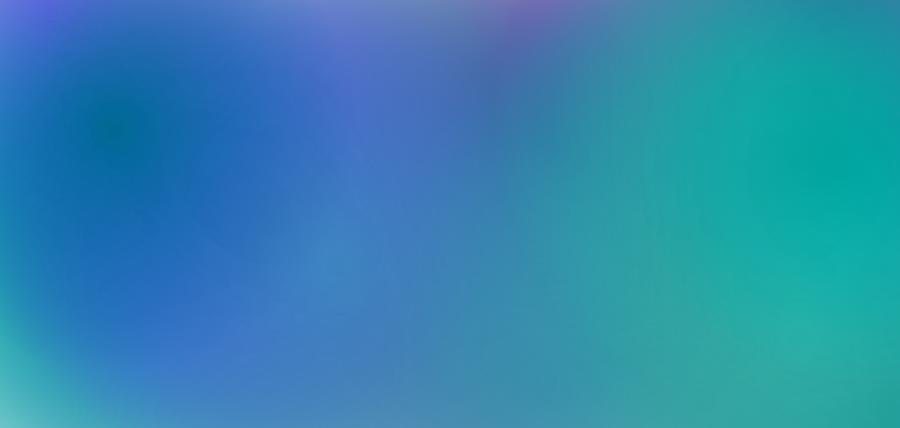

# Gradient Animation

Este repositório contém um projeto visual interativo que cria animações suaves e dinâmicas de partículas com gradientes coloridos. As partículas se movem pela tela, formando um efeito visual impressionante que mistura cores e transparências.

## 🖌️ O que é?

O **Gradient Animation** é uma aplicação em JavaScript que utiliza o elemento `<canvas>` para renderizar partículas animadas. Cada partícula é desenhada com um gradiente radial.

## 🚀 Como funciona?

- **Partículas Dinâmicas**: As partículas têm tamanhos e movimentos aleatórios, criando uma animação fluida e imprevisível.
- **Gradientes Radiais**: Cada partícula é desenhada com um gradiente que vai de opaco no centro a transparente nas bordas.
- **Responsividade**: O canvas se ajusta automaticamente ao tamanho da janela, garantindo que a animação ocupe toda a tela.

## 📂 Estrutura do Projeto

- **`gradient.js`**: Contém a lógica principal da animação, incluindo a criação e movimentação das partículas.
- **`glowparticle.js`**: Define a classe `GlowParticle`, responsável por desenhar e animar cada partícula.
- **`style.css`**: Define o estilo básico da página, garantindo que o canvas ocupe toda a tela.
- **`index.html`**: O ponto de entrada do projeto, que carrega o script e exibe a animação.

## 🖥️ Como usar?

1. Clone este repositório:
   ```bash
   git clone https://github.com/seu-usuario/gradient-animation.git
2. Abra o arquivo `index.html` em seu navegador.
3. Aproveite a animação!

## 🎨 Personalização

Você pode personalizar as cores das partículas editando o array `COLORS` no arquivo `gradient.js`.
Por exemplo, para adicionar novas tonalidades, basta incluir objetos RGB no array:
```javascript
const COLORS = [
    { r: 0, g: 105, b: 148 },  // Deep Sea Blue
    { r: 75, g: 0, b: 130 },   // Indigo
    { r: 138, g: 43, b: 226 }  // Blue Violet
];
```
## 📸 Prévia


## 🛠️ Tecnologias Utilizadas
- **`HTML5 Canvas`**: Para renderizar as partículas.
- **`JavaScript`**: Para a lógica de animação.
- **`CSS`**: Para estilização básica.

## 📜 Licença

Este projeto está licenciado sob a [MIT License](LICENSE).

---
### **✨ Divirta-se explorando as cores e criando animações incríveis! ✨**
